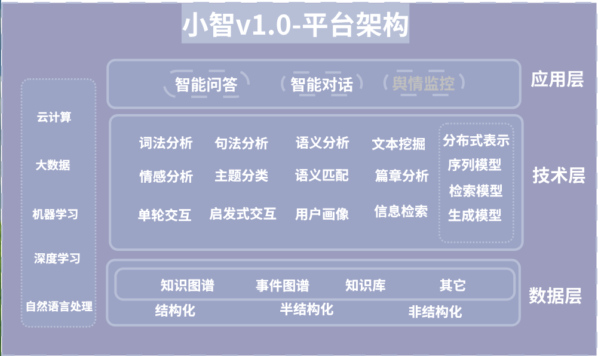

# 智能问答与对话系统研究与应用
<!-- TOC -->

- [智能问答与对话系统研究与应用](#智能问答与对话系统研究与应用)
    - [小智平台初步技术架构](#小智平台初步技术架构)
    - [日常研究总结](#日常研究总结)
    - [对话系统分类](#对话系统分类)
    - [业界问答系统搭建方法](#业界问答系统搭建方法)
    - [业界人机对话技术](#业界人机对话技术)
    - [对话系统核心模块](#对话系统核心模块)

<!-- /TOC -->

## 小智平台初步技术架构　
  

---
## 日常研究总结
- [ESIM_Alibaba](http://naotu.baidu.com/file/35d306210f00fa32e80819ab23faaacd?token=a21cc2541fea5bed)
## 对话系统分类  
- 问答型  
  + 结构性文档  
    - 数据库、知识库  
  + 非结构性文档  
    - 信息抽取/信息检索
- 对话型
   + 闲聊型
   + 任务型：领域分类/用户意图/槽位
## 业界问答系统搭建方法
- 检索式问答
  + 利用信息检索的方法，从问答知识库中检索出最相关的问题对应的答案作为回复，其核心是进行了问题-问题间匹配。基于文本表示的孪生网络（Neculoiu et al.,2016; huang et al.,2013）和基于交互式匹配（chen et al.,2017; chen et al.,2018）的方法是文本匹配领域的两大主流技术。
- 生成式问答
  + 主流方式是通过Seq2Seq（Sutskever et al.,2014，Wang et al.,2018）模型对用户问题进行编码（encoder），然后解码（decoder）生成回复内容。
- 阅读理解
  + 通过注意力机制使用户问题和文档进行相互理解，然后从文档中抽取合理的片段作为回复内容（Seo et al.,2017，Yu et al.,2018）。
- 知识图谱问答
  + 问答可以通过Sql查询（Berant et al.,2013），分类（Ferhan et al.,2017），相似度匹配(Yu et al.,2017)等方式从知识图谱中直接获取回复；或者通过注意力机制（He et al.,2017）或记忆网络（Madotto et al.,2018）等方式把知识图谱作为先验知识融入到问题表征中来帮助获取更好的回复。
 
## 业界人机对话技术
- [多轮人机对话与对话管理技术探索与实践--平安寿险PAI](https://mp.weixin.qq.com/s/k-Uatc59J1MxZY8ZaUwS8w) 
- IBM-watson系统（重点）
  + [DeepQA Team](https://researcher.watson.ibm.com/researcher/view_group_pubs.php?grp=2099&t=1)
  + [Building Watson: An Overview of the DeepQA Project](https://www.aaai.org/Magazine/Watson/watson.php)
  + [wiki Watson_(computer)](https://en.wikipedia.org/wiki/Watson_(computer))
  + [Watson的独特“思考”](http://history.programmer.com.cn/13468/)
- Microsoft-XiaoIce系统 （重点）
  + [微软小冰对话机器人架构](http://breezedeus.github.io/2019/02/23/breezedeus-xiaoice-framework.html)

## 对话系统核心模块
> 自然语言理解模块 —— Natural Language Understanding (NLU)  
> 对话管理模块 —— Dialog Management (DM)  
> 自然语言生成模块 —— Natural Language Generation (NLG)  

---
Updated on February 29,2020